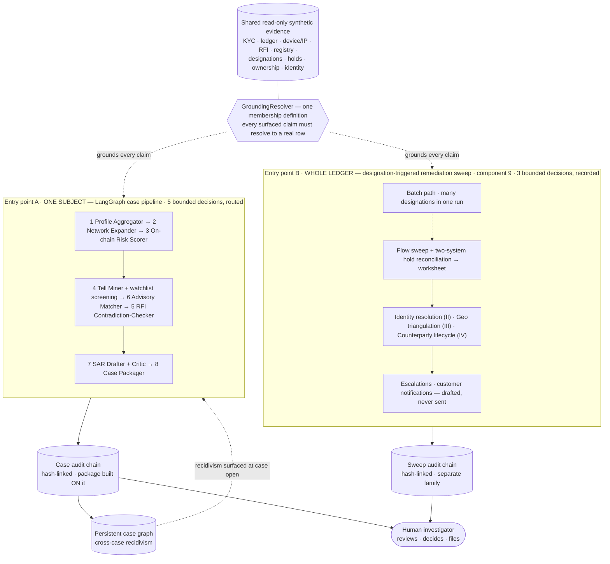

<p align="center">
  
</p>

# Okojo — an Agentic Crypto-Investigations Co-Pilot

> **Status:** Phases 0–7 complete — the core is reliability-hardened and
> portfolio-ready. Fully synthetic data, built in the open. Details in
> [Status & roadmap](#status--roadmap).

## The Problem

Financial-crime investigators at crypto exchanges do demanding work well, and largely in spite of the infrastructure around them. The tooling, not the talent, fails in three well-documented ways.

The systems don't talk to each other. The on-chain side is the easy half: the blockchain is public, and any investigator with a proper tracing tool can follow it. The half only the exchange holds is what fragments. KYC files, login and device records, free-text remarks, and internal transfers that never touch the chain sit in a dozen disconnected systems. The narrative a regulator wants is the join between those two halves, and today the internal half gets stitched together by hand under deadline.

The tooling reviews accounts one at a time, while the risk lives at the cluster level: the shell ring, the shared device, the wallet whose gas someone else quietly pays. An investigator who wants the network view has to build it manually, when there's time, from systems that were never designed to show it.

And the record of who looked at what, and why a case was closed, is only as trustworthy as the controls around it. The documented failure mode here is governance capture: "internal account" tags that shield subjects, records that go missing. No amount of investigator diligence can defend against that when the record-keeping itself has no tamper-evident home.

Okojo is a research prototype exploring how an agentic AI co-pilot gives investigators infrastructure that carries its share of the load, built the way a regulator would want it built: every factual claim carries a provenance pointer, every action lands in a tamper-evident audit trail, and a human always reviews, decides, and files.

## What it does

Given a flagged account on **fully synthetic data**, Okojo assembles a unified
subject profile, expands the account into its network (shared devices, reused
KYC documents, gas-funding linkage), scores on-chain sanctioned exposure,
mines free-text remarks for attribution tells, tests the subject's own
RFI answers against the evidence claim by claim, matches the case to the
relevant FinCEN advisories, and drafts a grounded, self-critiquing Suspicious
Activity Report — handing the human investigator a decision-ready package
built on the audit trail itself.

---

## ⚠️ What this is — and what it is NOT

**What this is:** a demonstration, on **fully synthetic data**, of how agentic AI
can support (never replace) a human investigator in a regulated workflow.

**What this is NOT:**

- **Not** a production screening or transaction-monitoring system.
- **Not** legal, compliance, or sanctions advice.
- **Not** a SAR-filing tool — a human reviews, decides, and files. SARs carry
  strict confidentiality obligations; nothing here should be construed as, or
  used for, an actual regulatory filing.
- **Not** built on, and does **not** contain, any real customer data, real
  identities, real wallet addresses, or real documents. Every person, company,
  address, device, and transaction is fabricated by the generator in
  `src/okojo/scenario/`.

The scenario **replicates behavioural patterns** documented in public reporting
and sanctions actions (shell-entity rings, reused KYC documents, structured
transfers, false RFI narratives) so the co-pilot has realistic material to reason
over. Patterns are not people.

---

## Architecture

Okojo has **two entry points over one shared, read-only synthetic core.** A
single-subject **case pipeline** runs as a compiled **LangGraph state machine** —
deterministic by design (legibility is a compliance feature), with **five bounded
decision points** that *route* the graph, each a pure rule stamped into the audit
chain with its rationale so the path taken and the audit trace cannot disagree.
The Phase-8 capstone adds a second entry point — a **designation-triggered
remediation sweep** over the *whole ledger* — with **three more bounded decisions**
that are *recorded* (review-tier, not routed). Both walk the same evidence, ground
every surfaced claim through **one** membership definition (`GroundingResolver`),
and write their **own** hash-chained audit trail — the two chain families never
touch.



Every stage, tool call, and decision writes to the **append-only, hash-chained
audit trail** — the spine, not a side-car: the case package is built *on* it, and
the sweep writes its own separate chain. Individual decision routing and the
per-stage records are omitted from the diagram for legibility (the full code map
lands in Phase 9).

**The nine components** (numbering is the target design, not build order):

1. **Profile Aggregator** — unified subject timeline across mock internal systems.
2. **Network Expander** — 1–7-hop cluster mapping with device/`device_fingerprint`, reused-KYC, and **gas-funding** linkage.
3. **On-chain Risk Scorer** — cluster exposure against a synthetic sanctions/illicit set.
4. **Remark/Tell Miner** — fuzzy-matches user free-text to entities/aliases.
5. **RFI Contradiction-Checker** — decomposes RFI answers into claims and tests each against the evidence.
6. **Regulatory Advisory Matcher** — FinCEN-advisory RAG, event-triggered on RFI key terms.
7. **SAR Drafter + Critic** — grounded, self-critiquing narrative generation.
8. **Case Packager + persistent case graph** — decision-ready package, append-only audit log, cross-case recidivism.
9. **Designation-Triggered Remediation Sweep** *(v1.0 capstone)* — given a new OFAC designation, sweep the full ledger for exposed accounts and draft remediation.

### The capstone in action: a designation → a remediation worksheet

Component 9 adds a **second entry point** over the finished core. Paste a
synthetic OFAC-style designation — a name and/or on-chain addresses — and Okojo
sweeps the **whole ledger** (not one subject) for directly and indirectly
exposed accounts, reconciles hold status across two mock systems (the
data-integrity gap documented in public enforcement actions), triages by
exposure size and hop distance, and produces a **grounded remediation
worksheet** plus internal escalation drafts — *drafted, never sent*.

The sweep **reuses the core and never moves it**: it walks the same read-only
evidence, grounds every surfaced row in a provenance pointer, fails closed on a
row it cannot cite, and writes its **own** fresh tamper-evident chain (the case
chains are untouched). Designed traps keep the eval honest — a decoy
designation that touches nothing returns the empty set; an account with legacy
sanctioned exposure but no flow to the *newly designated* addresses is excluded
(no replay of an old answer key); a privileged/internal tag is flagged for
review, never obeyed. Try it from the sidebar **"Designation sweep"** mode.

> **Status:** the capstone is **complete** — the flow sweep (Phase 8, Part I),
> cross-list early warning (Part I-B), identity resolution (Part II), geographic
> triangulation (Part III), and the counterparty-designation lifecycle (Part IV)
> are all built and public.

---

## Responsible AI & the tamper-evident audit trail

For a regulated workflow this section is the product, not the disclaimer.

### Human-in-the-loop, mechanically

The agent **proposes, surfaces, drafts, and flags — a person decides and
files.** That boundary is structural, not aspirational: the five decision
points are deterministic rules with published thresholds
(`docs/agency-methodology.md`); their effects are boundary-guarded (the
runner-up advisory is surfaced only, the follow-up RFI is drafted but never
sent, insufficient evidence refers the case to a human rather than forcing a
draft); and a SAR that cannot reach full rubric coverage is flagged for
analyst review, never padded.

### The grounding contract, fail-closed

The drafter may assert **only** facts that trace to a retrieved evidence row.
Every claim carries a provenance pointer; every pointer must **resolve to a
real row** (not merely be non-empty), and an unresolvable citation aborts the
draft rather than shipping it. Whatever the evidence cannot support is flagged
— never fabricated. The demo UI holds itself to the same rule: every surfaced
claim, score, verdict, and narrative sentence renders its pointer beside it.

### The hash chain, explained

Each audit record's `hash` is the SHA-256 of its own payload **including the
previous record's hash** — so mutating, dropping, or reordering any record
breaks every hash after it, and verification fails loudly. The chain is
append-only and covers every access, tool call, decision (with rationale),
and stamp. The case package is built *on* the chain — it references each
record by `(seq, hash)`, and the chain's final stamp carries the package
file's SHA-256: the log covers the package, and the package pins the log.

### "Internal account" tags: flagged, never obeyed

The decisive failure mode in publicly documented enforcement actions is
**governance capture** — privileged accounts shielded from review, records
made to vanish. Okojo plants exactly that red herring ("internal account,
do-not-block") and treats it as **evidence to surface, not an instruction to
follow**: the tag is flagged in the UI, preserved in the case package, and a
test pins that no disposition ever cites it as a reason to stand down.

### Anti-tipping-off, by construction

Warning a subject that their activity is under review — "tipping off" — is a
well-established prohibition across AML regimes, and a commonly understood
obligation at any regulated institution (stated at the level of principle;
this is not legal advice). Okojo's only subject-facing
output (draft follow-up RFI requests) is built to be structurally incapable
of it: requests use neutral administrative templates that cite only the
subject's own records, never name the denied entity, and never reference
device linkage, tracing focus, or review status — and every rendered request
must pass a **fail-closed screen** (`assert_no_tipping_off`); anything that
trips it is suppressed and flagged for human authoring instead.

### Versioned, measured, and drift-guarded

Every scoring formula, retrieval gate, rubric, and decision threshold is a
**versioned, published policy parameter**: eight methodology documents under
`docs/` each carry their component's exact config, a test asserts the
document matches the code, and the config is stamped into the audit chain of
every run — so any historical result can be reproduced and defended.

---

## Evidence: every capability ships its eval

The synthetic generator emits `ground_truth.json` — a committed answer key —
and every capability is scored against it or against a hand-authored gold
key: network recall, screening and exposure metrics, advisory false-positive
rate and discrimination, SAR grounding coverage, a with/without-Critic
ablation, RFI contradiction detection with verdict and source discrimination,
the decision trace against a domain-authored expected-decision key, and
recidivism surfacing. A reliability harness runs the full pipeline for
**every** subject in the scenario — including the isolated, no-network
degenerates — and asserts the grounding, rendering, and loop-termination
properties mechanically.

```bash
pytest -q                 # the full suite
pytest -s -k "phase1 or phase2 or advisory or sar_eval or rfi_eval or sweep_eval"   # scorecards
pytest -s -k "decision_trace or casegraph or reliability"             # agency + reliability
```

---

## Quickstart

```bash
python -m venv .venv && source .venv/bin/activate
pip install -r requirements.txt

# generate the synthetic oil / sanctions-evasion scenario
python scripts/generate_scenario.py

# run the tests
pytest -q

# launch the demo (pick a subject, watch the case flow end-to-end)
streamlit run app/streamlit_app.py
```

Output is written to `data/synthetic/` (git-ignored). Because generation is
fully deterministic (seeded), the dataset regenerates identically — so only the
generator is committed, never the data.

### What the generator plants

A cross-border ring with an ultimate controller hiding behind family- and
employee-cutout directors, plus the tells a good investigator looks for — each
also recorded in `ground_truth.json` as an answer key for scoring:

| Pattern | Where it shows up |
|---|---|
| Reused KYC document across "separate" entities | `kyc_docs.csv`, `accounts.csv` |
| Shared devices (`device_fingerprint`) across unrelated accounts | `devices.csv` |
| Logins from a sanctioned jurisdiction interleaved with VPN | `ip_logs.csv` |
| Structured just-under round-number transfers | `transactions.csv` |
| Gas-funding that betrays control of a "non-custodial" wallet | `gas_funding.csv` |
| Withdrawal remarks naming the true controller | `transactions.csv` |
| A licensed-trust RFI narrative contradicted by the evidence | `rfi.csv` + `ground_truth.json` |
| A recidivist account that cleared prior "retain & monitor" reviews | `accounts.csv` |
| An "internal account, do-not-block" red-herring tag | `accounts.csv` |
| A synthetic OFAC-style designation + its exposed sub-network | `designations.csv`, `addresses.csv` |
| Hold-status drift between two sanctions systems (the reconciliation gap) | `sanctions_hold_warehouse.csv`, `sanctions_hold_admin.csv` |

---

## Status & roadmap

**Built (Phases 0–6):** components 1–8, end-to-end on one synthetic scenario —
the LangGraph conversion with the five bounded decision points, the persistent
case graph with recidivism surfacing at case open, and the case package built
on the hash-chained audit trail, demoed across a 9-tab Streamlit app.

**Phase 7 (complete):** the reliability tail turned into executable properties
— a harness that runs the full pipeline for *every* subject (including the
isolated, no-network degenerates) and mechanically asserts grounding, render
integrity, loop termination, and that every SAR claim's evidence is genuinely
the subject's own (a defect the harness itself found: the headline ablation
metric was corrected *downward* once measurement showed it credited borrowed
evidence). UI provenance completion — every surfaced claim renders its pointer
— and the README you are reading. One lesson worth stating plainly: the
generator had drawn **21 of 24 account histories with activity dated before
the account existed**, and six phases of green, table-shaped tests never
noticed — building the Timeline as an actual chronology surfaced the
impossibility in seconds. Views that make data *legible* are themselves a
verification tool, not cosmetics.

**Phase 8 (complete) — the Designation-Triggered Remediation Sweep, component 9
and the v1.0 capstone.** A second entry point runs over the *whole ledger* and
writes its own hash-chained audit trail, reusing the read-only core through the
one grounding definition:

- **Part I — flow sweep:** exposed accounts by flow and hop distance, two-system
  hold reconciliation (the documented data-integrity gap), and a grounded
  remediation worksheet plus escalation drafts — never sent.
- **Part I-B — cross-list early warning:** calibrated designation kinds
  (obligation vs. signal) that surface cross-list exposure ahead of a formal
  listing.
- **Part II — identity resolution:** variant-aware screening, corroboration
  against published identifiers, beneficial-owner and proximity walks, and a
  subject-facing identity-review RFI.
- **Part III — geographic triangulation:** a six-signal totality over a
  designated territory with a totality-driven proposal decision; VPN use is an
  obfuscation marker, never location evidence.
- **Part IV — counterparty-designation lifecycle:** after a counterparty service
  is designated, an eighth bounded decision proposes the disposition (lift the
  restriction / offboard / hold), a customer notification is drafted fail-closed
  against tipping-off (never sent), and a guard proves the pipeline can never
  auto-unblock.

The SAR calibration guard is also wired live into draft validation — over-claiming
language is rejected fail-closed, alongside the grounding contract.

**Next — Phase 9 (launch hardening):** continuous integration, a security pass, a
snippet-level SCA scan, a cloud deploy of the demo, a recorded walkthrough, and a
full code-systems map.

**Roadmap (post-v1.0):**

- **Coverage-gap check** — the customer base's geographic footprint measured
  against the enabled list-source regimes, surfaced as a standing signal (are we
  screening against the lists our actual exposure calls for?).
- **Audit Narrator** — a grounded summarizer over the system's own audit trails,
  scoped to **all** chain families (case, sweep, and batch), making the
  tamper-evident record *reviewable*, not just provable.
- **API service facade** — the sweep and case pipelines are already payload-in /
  proposals-out by design (validated payloads, grounded proposals, an append-only
  audit trail between); production exposure is connector and infrastructure work,
  not a redesign.
- ML alert auto-closure QA · vendor reconciliation · tokenized-commodity issuance
  tracing · multilingual OSINT verifier · LE-request/MLAT routing.

## Author

Built by **Jennifer Hicks**, a crypto-compliance leader exploring agentic AI for
regulated financial-crime investigations. Connect on
[LinkedIn](https://www.linkedin.com/in/hije/).

## Contributing

Issues, feedback, and discussion are very welcome — please open an issue if
something's unclear, broken, or worth debating. The project is **not accepting
pull requests at this time** (it's a solo portfolio build), but that may change
down the road. Thanks for taking a look!

## License

MIT — see [LICENSE](LICENSE).
