# Okojo — Code Systems Map

**Status:** synthetic-data research prototype. This is the module-level companion
to the conceptual architecture diagram in [`README.md`](../README.md) and the
design narrative in [`Strategy.md`](Strategy.md). It answers a different question
than either: *where does each behaviour actually live in the source tree?* Every
non-package-init, non-test module under `src/okojo/`, plus the demo app and the
data-generation script, is listed once with a one-line purpose and its key public
symbols.

The map is **kept honest by a test.**
[`tests/test_code_map.py`](../tests/test_code_map.py) enumerates the exact module
set from the filesystem and fails if the map and the tree ever disagree in
either direction — a new module that no one documented, or a documented module
that no longer exists. So this file cannot silently drift out of date the way a
hand-kept inventory usually does.

## How the source tree is organised

Okojo is one read-only analytical core with **two entry points** over it. The
core turns a shared, synthetic evidence base into grounded, human-reviewable
findings; every stage writes to an append-only, hash-chained audit trail. Entry
point **A** runs one subject through the LangGraph case pipeline (components 1–8);
entry point **B** runs a new designation across the whole ledger (component 9,
the remediation sweep). A single grounding definition governs both, and the
Audit Narrator (Phase 9) reads either chain back out in plain language.

```mermaid
flowchart TD
    subgraph FOUND["Foundation — deterministic data + shared primitives"]
        direction LR
        SCN["scenario<br/>generator · models · fakelite"]
        CFG["config · provenance · eval"]
        CONN["connectors<br/>DuckDB over synthetic CSVs"]
        SCN --> CONN
    end

    AUD["audit — append-only hash chain<br/>(the spine every stage writes to)"]
    ENT["entity backbone<br/>one canonical view per case"]
    CONN --> ENT

    subgraph A["Entry point A · case pipeline (components 1–8)"]
        direction TB
        AGG["1 aggregator"] --> NET["2 network"] --> SCO["3 scorer"]
        SCO --> REM["4 remarks"] --> RFI["5 rfi"] --> ADV["6 advisory"]
        ADV --> SAR["7 sar drafter + critic"] --> PKG["8 casegraph + packager"]
    end

    subgraph B["Entry point B · remediation sweep (component 9)"]
        direction TB
        DES["designation → exposure → verify"] --> WKS["worksheet + escalations"]
        WKS --> STG["identity · geo · lifecycle stages"]
        STG --> SPK["sweep packager + batch"]
    end

    ENT --> A
    CONN --> B
    ORCH["orchestrator + agency<br/>LangGraph + bounded decisions"] --> A
    A --> AUD
    B --> AUD
    AUD --> NAR["narrator — read-only<br/>chain → plain language"]
    UI["app — Streamlit demo"] --- A
    UI --- B
    UI --- NAR
```

The diagram is deliberately curated at the package level; the table below is the
exhaustive, test-guarded inventory.

## Foundation — deterministic data + shared primitives

| Module | Purpose | Key public symbols |
| --- | --- | --- |
| `src/okojo/config.py` | Global constants and the deterministic seed the whole synthetic world regenerates from. | `SEED`, `SIM_START`, `SIM_END`, `SYNTHETIC_DIR`, `RING_JURISDICTIONS` |
| `src/okojo/provenance.py` | The grounding primitive — a fact bound to the record it came from. | `Provenance`, `GroundedFact` |
| `src/okojo/eval/metrics.py` | Set-based precision / recall / F1 used by every capability eval. | `Score`, `precision`, `recall`, `f1`, `score` |
| `src/okojo/scenario/models.py` | Typed record shapes for every synthetic table. | `Account`, `Transaction`, `Designation`, `Rfi`, `SdnEntry` (+ 23 more) |
| `src/okojo/scenario/generator.py` | Deterministic synthetic-scenario generator (seeded; regenerates byte-identically). | `generate_scenario` |
| `src/okojo/scenario/_fakelite.py` | Dependency-free stand-in for the Faker subset used, so the generator still runs without Faker. | `FakeLite` |
| `src/okojo/connectors/store.py` | DuckDB-backed store presenting the synthetic CSVs as mock internal systems. | `Record`, `Store` |
| `src/okojo/bootstrap.py` | Boot hook that regenerates the (gitignored) synthetic dataset in-process on a fresh deploy; a no-op when data is already present. | `provision_scenario_dataset`, `ensure_default_scenario_dataset`, `scenario_dataset_present` |
| `src/okojo/audit/log.py` | Append-only, hash-chained audit log + located chain verification. | `AuditLog`, `verify_records`, `ChainVerification`, `GENESIS_HASH` |
| `src/okojo/entity/backbone.py` | One canonical, de-duplicated view of every entity in a case. | `EntityBackbone`, `Entity`, `build_backbone` |

## Entry point A — the case pipeline (components 1–8)

| Module | Purpose | Key public symbols |
| --- | --- | --- |
| `src/okojo/aggregator/profile.py` | Component 1 — a unified, anomaly-flagged subject timeline across the mock systems. | `build_profile`, `ProfileTimeline`, `TimelineEvent` |
| `src/okojo/aggregator/anomalies.py` | The anomaly detectors the timeline runs (geo/IP, VPN, reused KYC, shared device, internal tag). | `detect_all`, `ALL_DETECTORS`, `Anomaly` |
| `src/okojo/network/expander.py` | Component 2 — 1–7-hop cluster expansion over device / reused-KYC / gas-funding linkage. | `expand`, `NetworkExpansion`, `clamp_hops` |
| `src/okojo/network/roster.py` | A triage roster over a network expansion. | `build_roster`, `RosterRow` |
| `src/okojo/network/render.py` | Static, self-contained pyvis render of an expansion. | `render` |
| `src/okojo/scorer/scorer.py` | Component 3 — on-chain risk scorer with a first-class, versioned score decomposition. | `score_risk`, `RiskScoring`, `scoring_config`, `SCORING_VERSION` |
| `src/okojo/remarks/miner.py` | Component 4 — fuzzy remark/tell miner over free-text. | `mine_remarks`, `RemarkTell` |
| `src/okojo/remarks/screening.py` | SDN / alias screening of account names against the synthetic watchlist. | `screen_aliases`, `AliasMatch`, `SCREEN_THRESHOLD` |
| `src/okojo/rfi/reader.py` | Component 5 — read-only RFI surfacing. | `load_rfi`, `RfiView`, `RfiClaim` |
| `src/okojo/rfi/claims.py` | Decomposes an RFI response into discrete, aligned claims. | `decompose`, `RfiDecomposition`, `ExtractedClaim` |
| `src/okojo/rfi/checkers.py` | The four adversarial probes that test one claim against the evidence. | `run_checkers`, `CHECKERS`, `Rebuttal` |
| `src/okojo/rfi/contradiction.py` | Adjudicates the probes into verdicts with a versioned weighting. | `check_contradictions`, `contradiction_config`, `CONTRADICTION_VERSION` |
| `src/okojo/advisory/embeddings.py` | Swappable embedding backends behind one interface (ST model + lexical fallback). | `get_embedder`, `Embedder`, `DEFAULT_MODEL` |
| `src/okojo/advisory/retrieval.py` | Exact in-memory cosine retrieval over the embedded corpus (no vector DB). | `CosineRetriever`, `RetrievedItem` |
| `src/okojo/advisory/matcher.py` | Component 6 — hybrid advisory matcher (keyword + semantic + corroboration), versioned. | `match_advisories`, `retrieval_config`, `RETRIEVAL_VERSION`, `AdvisoryMatch` |
| `src/okojo/sar/schema.py` | The SAR draft schema and the grounding + calibration contract. | `SarDraft`, `assert_grounded`, `assert_calibrated`, `BANNED_TERMS` |
| `src/okojo/sar/validate.py` | Resolves every SAR claim citation to a real evidence row (fail-closed). | `GroundingResolver`, `assert_resolvable`, `validate_grounding` |
| `src/okojo/sar/drafter.py` | Component 7 — the grounded, template-first SAR drafter. | `build_sar`, `gap_fill_claims`, `TELL_SCOPE` |
| `src/okojo/sar/critic.py` | The deterministic FinCEN-rubric critic that grades a draft. | `critique`, `critic_config`, `CRITIC_VERSION`, `Critique` |
| `src/okojo/sar/loop.py` | The bounded, deterministic drafter → critic → revision loop. | `draft_with_critic`, `MAX_REVISION_ITERATIONS` |
| `src/okojo/casegraph/store.py` | Component 8a — the persistent case graph and cross-case recidivism view. | `CaseGraphStore`, `RecidivismView`, `casegraph_config`, `CASEGRAPH_VERSION` |
| `src/okojo/packager/packager.py` | Component 8b — the decision-ready case package, built ON the hash chain. | `build_package`, `packager_config`, `PACKAGE_VERSION` |

## Orchestration + bounded agency

| Module | Purpose | Key public symbols |
| --- | --- | --- |
| `src/okojo/orchestrator/graph.py` | The compiled LangGraph state machine over the deterministic case backbone. | `build_case_graph`, `CaseState` |
| `src/okojo/orchestrator/pipeline.py` | The case runner that drives the graph end-to-end and writes the chain. | `run_case`, `CaseResult`, `default_out_dir` |
| `src/okojo/agency/decisions.py` | The bounded, deterministic decision points (expand / second advisory / re-RFI / sufficiency / bar / geo / lifecycle). | `decide_expand`, `decide_sufficiency`, `agency_config`, `AGENCY_VERSION` |

## Entry point B — the remediation sweep (component 9, the v1.0 capstone)

| Module | Purpose | Key public symbols |
| --- | --- | --- |
| `src/okojo/sweep/designation.py` | Fail-closed designation parsing and designated-name screening. | `parse_designation`, `match_designated_name`, `Designation` |
| `src/okojo/sweep/exposure.py` | Reverse-BFS exposure walker over the full ledger (by flow + hop distance). | `sweep_exposure`, `ExposureResult`, `ExposedAccount` |
| `src/okojo/sweep/verify.py` | Two-system sanctions-hold reconciliation (block-status gaps). | `verify_block_status`, `StatusGap` |
| `src/okojo/sweep/worksheet.py` | The triaged, grounded, fail-closed remediation worksheet. | `build_worksheet`, `WorksheetRow`, `assert_worksheet_resolvable` |
| `src/okojo/sweep/escalations.py` | Internal escalation drafts — drafted, validated, never sent. | `draft_escalations`, `EscalationDraft` |
| `src/okojo/sweep/identity_rfi.py` | The identity-review RFI (the first subject-facing surface). | `draft_identity_review_rfis`, `IdentityReviewRfi` |
| `src/okojo/sweep/geo.py` | Geo-triangulation wiring for the sweep. | `run_geo_triangulation`, `territory_profile` |
| `src/okojo/sweep/geo_proposal.py` | One review-tier geo-action proposal per surfaced dossier. | `build_geo_proposals`, `GeoProposal` |
| `src/okojo/sweep/lifecycle.py` | Counterparty-designation lifecycle + the drafted (never sent) customer notification. | `draft_counterparty_notifications`, `derive_counterparty_lifecycle_state`, `LifecycleDisposition` |
| `src/okojo/sweep/packager.py` | The decision-ready sweep package, built ON the sweep chain. | `build_sweep_package`, `write_sweep_package` |
| `src/okojo/sweep/pipeline.py` | The sweep runner and the batch (many-designation) path. | `run_sweep`, `run_sweep_batch`, `SweepResult`, `BatchResult` |

### Sweep-supporting analysis — identity + geo

| Module | Purpose | Key public symbols |
| --- | --- | --- |
| `src/okojo/identity/variants.py` | Variant-aware name expansion and screening. | `expand_name_variants`, `screen_name_variants`, `VariantNameMatch` |
| `src/okojo/identity/ownership.py` | Beneficial-owner and officer walk. | `walk_ownership`, `OwnershipWalkResult` |
| `src/okojo/identity/proximity.py` | The proximity ring around a resolved identity. | `build_proximity_ring`, `ProximityRing` |
| `src/okojo/geo/signals.py` | Geo-triangulation signal collectors + the totality dossier. | `assemble_dossier`, `GeoDossier`, `GeoSignal` |
| `src/okojo/designation_check/check.py` | v1.1 subject-as-seed designation check — the case-side mirror of the sweep; a read-only composition of the sweep/geo/identity machinery that writes to no chain. | `run_designation_check`, `DesignationCheckResult`, `compute_badge` |
| `src/okojo/coverage/assessment.py` | Institution-level screening coverage-gap check — measures the customer base's three-leg geographic footprint against the enabled+ingested list-source regimes and surfaces covered / gap jurisdictions as cited findings. Read-only; reads the frozen sweep registry, writes no chain. | `run_coverage_assessment`, `CoverageAssessment`, `JurisdictionCoverage`, `FootprintLeg` |
| `src/okojo/coverage/pipeline.py` | The coverage assessment's own hash-chained audit trail (a new chain family under `data/coverage/`) — stamps the finding into a fresh tamper-evident chain, mirroring the sweep's own-chain discipline. Reuses the read-only assessment; changes nothing. | `run_coverage_audit`, `CoverageAuditResult`, `default_coverage_dir` |

## Audit narration, UI, and data generation

| Module | Purpose | Key public symbols |
| --- | --- | --- |
| `src/okojo/narrator/narrator.py` | Phase 9 — the grounded, read-only summarizer that turns a hash chain into plain-language sentences. Writes to no chain. | `narrate_chain`, `narrate_chain_batch`, `narrator_config`, `NARRATOR_VERSION` |
| `app/streamlit_app.py` | The Streamlit demo UI over both entry points and both audit chains. | `get_connectors`, `main` |
| `scripts/generate_scenario.py` | CLI entry point that regenerates the synthetic dataset and prints a summary. | `main` |
